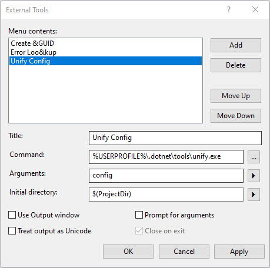
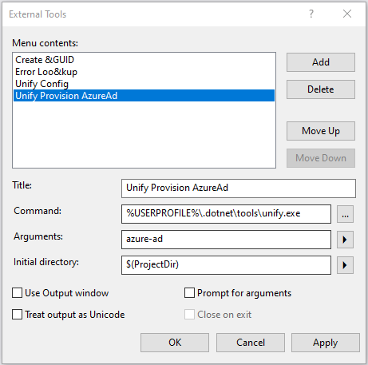
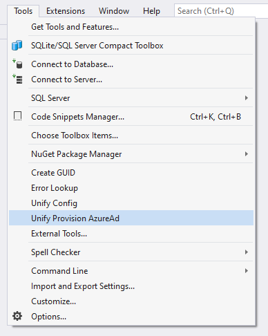

# Unify.Cli

The Unify command line interface is designed to be used by the Unify templates automatically on creation if using `dotnet new` or as an 'External Tool' in Visual Studio.

### Install

Either install the Unify.Cli tool globally

```bash
dotnet tool intall -g Unify.Cli
```

Or use as a project local tool:

```bash
dotnet new tool-manifest
dotnet tool intall Unify.Cli
```
To uninstall the tool:

```bash
dotnet tool uninstall unify.cli -g
```

### Configure a Unify application

From the root of the project:

```c#
unify config
```
This creates a "Unify.App.Id" file in the root of the project and creates or updates the *User Secrets* file with the following (example) data:

```json
{
  "Unify": {
    "Application": {
      "Id": "2Rt5n6K3-myapp-nxxxxx",
      "MasterKey": "ABC123",
      "RsaKeys": {
        "PublicKey": "\u003CRSAKeyValue\u003E\u003CModulus\...",
        "PrivateKey": "\u003CRSAKeyValue\u003E\u003CModulus\..."
      }
    }
  }
}
```

### Provision an AzureAd App registration

From the root of the project:

```c#
unify azure-ad
```

*NB* The first time you run this tool you **may** need to login. The tool will attempt to find any relevant cached tokens you have but if none are found, your browser will open up to allow you to login to the `uni.strath.ac.uk` Azure instance.

This creates an [App registration on the Azure Portal](https://portal.azure.com/#blade/Microsoft_AAD_IAM/ActiveDirectoryMenuBlade/RegisteredApps) and returns the `ClientId` and `ClientSecret`.

Both these values are stored safely in the application's *User Secrets* file with the following (example) data.

```json
{
	"Unify": {
		"Identity": {
		  "AzureAd": {
			"ClientId": "1234567-8910-11121314-151617",
			"ClientSecret": "-hD38f5__0rphDIAPFa5-NEt0ev074~d1H"
		  }
		}
	}
}
``` 

### Using the Cli within Visual Studio

If you are not keen on using command line interfaces, you can use the Unify.Cli as an external tool in VisualStudio:

1. In Visual Studio, select **Tools | External Tools ...**
2. Select the **Add** button
3. Enter the following information:

   1a. For **Title**, use `Unify Config`
   
   2a. For **Command**: `%USERPROFILE%\.dotnet\tools\unify.exe`
   
   3a. For **Arguments**: `config`
   
   4a. For **Initial directory*, use `$(ProjectDir)`
   
   5a. Un-check **Use output window**
   
   6a. Select OK
   

   
   1b. For **Title**, use `Unify Provision AzureAd`
   
   2b. For **Command**: `%USERPROFILE%\.dotnet\tools\unify.exe`
   
   3b. For **Arguments**: `azure-ad`
   
   4b. For **Initial directory*, use `$(ProjectDir)`
   
   5b. Un-check **Use output window**
   
   6a. Select OK
   


`Unify Config` and `Unify Provision AzureAd` now appear in the **Tools** menu which you can run on any loaded project in Visual Studio.



#### References

* https://github.com/AzureAD/microsoft-identity-web/blob/master/tools/app-provisioning-tool/README.md
* https://www.schaeflein.net/use-a-cli-to-get-an-access-token-for-your-aad-protected-web-api/
* https://github.com/Azure/azure-cli/blob/24e0b9ef8716e16b9e38c9bb123a734a6cf550eb/src/azure-cli-core/azure/cli/core/_profile.py#L65
